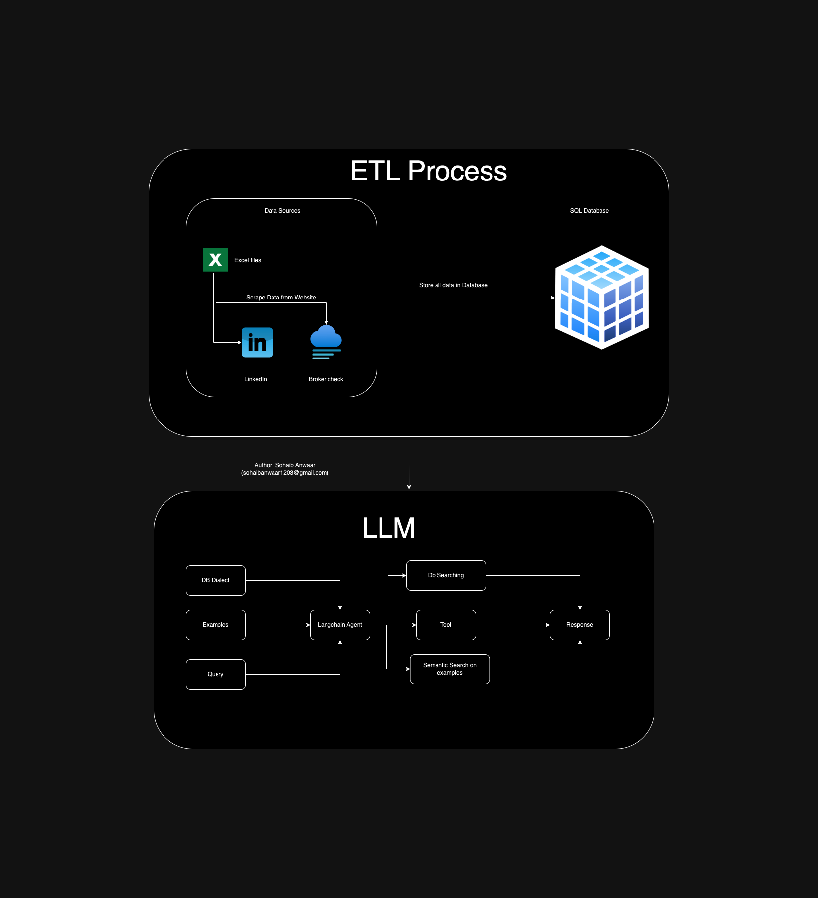

# Get Answers from you Database

Main Files:
1. ETL proccess use this: ETL_main.py
2. LLM : bot.ipynb


## Architecture




## Overview

This project is designed to perform an ETL (Extract, Transform, Load) process, loading data from CSV files into a database, scraping user profile data from LinkedIn using RapidAPI, and obtaining broker data from BrokerCheck. Additionally, it includes a Jupyter Notebook bot for querying the database based on the ingested data.

## Setup Instructions

### 1. Setup Environment

First, clone the repository to your local machine:

```bash
git clone https://github.com/your-username/your-repo.git
cd your-repo
```

Ensure you have Python 3.11

### 2. Create and Activate Virtual Environment

Create a virtual environment to manage dependencies:

```bash
python -m venv venv
```

Activate the virtual environment:

- On Windows:

  ```bash
  venv\Scripts\activate
  ```

- On macOS/Linux:

  ```bash
  source venv/bin/activate
  ```
#### With conda

```bash
conda create -n llm_etl python=3.11
conda activate llm_etl
```


### 3. Install Requirements

Install the required Python packages:

```bash
pip install -r requirements.txt
```

### 4. Create .env file

In the project folder, create a file named `.env` using the `env.example` file.

```bash
cp env.example .env
```

### 5. Run ETL Process

Execute the `main.py` script to perform the ETL process. This script will:

- Load data from the specified CSV file into the database.
- Scrape user profile data from LinkedIn using RapidAPI.
- Retrieve broker data from BrokerCheck.

`Note: Before running the ETL, delete the advisors.db file`

Run the script as follows:

```bash
python main.py
```

### 6. Run Jupyter Notebook Bot

Start the Jupyter Notebook server:

```bash
jupyter notebook
```

Open the `bot.ipynb` file in the Jupyter interface. This notebook is designed to connect to the database and allow users to query the data based on their requirements.